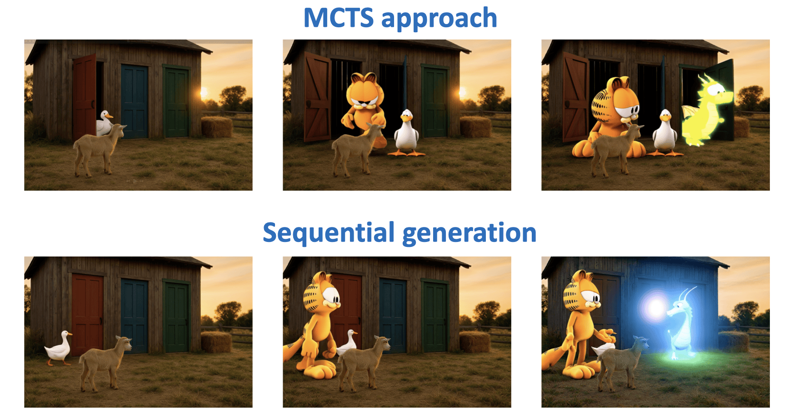
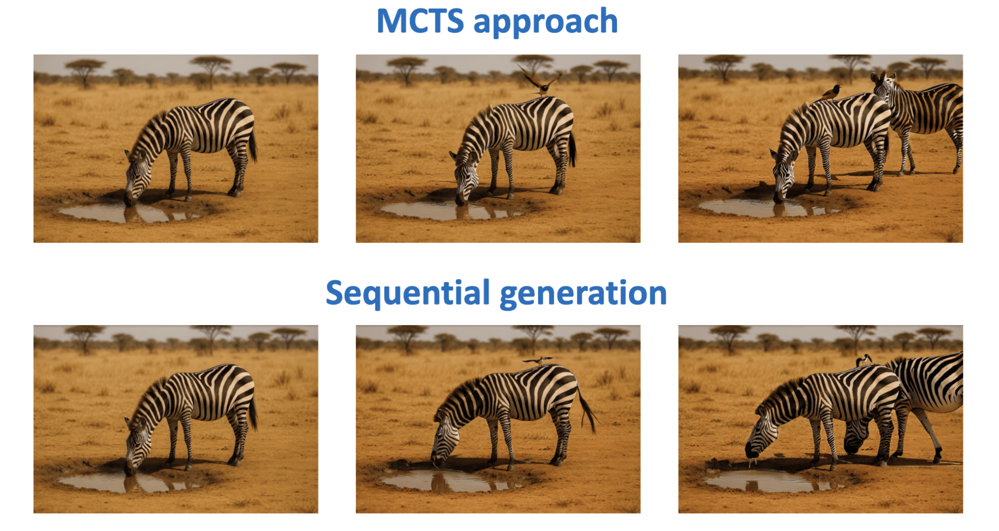

# Training-free long video generation leveraging MCTS combined with Diffusion Models

<!-- Test-Time Planning for Long-Form Video with MCTS + WAN 2.1 -->

A **test-time planning** (training-free) framework that combines **Monte Carlo Tree Search (MCTS)** with the WAN 2.1 image-to-video model to generate *long* videos that stay on-story.

This work addresses the fundamental challenge of **long video generation** where maintaining temporal coherence and narrative consistency becomes increasingly difficult as video length extends. Traditional sequential generation approaches suffer from **error accumulation** and **context drift**, leading to degraded quality in extended sequences. Our MCTS-based approach provides a principled solution by treating video generation as a **sequential decision-making problem** under uncertainty.

## 🎯 Overview
WAN 2.1 produces stunning short clips, but coherence unravels once you push past a few seconds.  
By viewing generation as a **sequential decision process**, MCTS can look several segments ahead, score candidate continuations with **VideoScore**, and choose the path that maximises long-range quality.

> **No model weights are updated** – we only spend extra compute at inference.


### 🚩 Why Long-Form Video Generation is Hard
Current video diffusion models excel at short clips but stumble once you push beyond a few seconds:

- **Temporal inconsistency** – quality falls off distribution as time grows  
- **Narrative drift** – without planning, stories lose logical order  
- **Error accumulation** – tiny artefacts snowball into glaring mistakes  
- **Limited exploration** – greedy decoding ignores potentially better futures

### 🔬 Research Landscape
* **Test-time planning** has boosted language models (e.g. *[MCTS-Judge](https://arxiv.org/abs/2502.12468)*) and game-playing agents; we show the same idea improves video diffusion with *zero* finetuning.  


* Our approach bridges the gap between powerful but myopic diffusion models and the need for **narrative planning**—a theme also pursued by recent [“one-minute video”](https://arxiv.org/abs/2504.05298) test-time-training work.  


## 🔑 What’s New Compared to Plain WAN
* **Look-ahead planning** (MCTS) with UCB selection.  
* **Systematic Exploration**: Discover diverse narrative possibilities through principled search
* **Plug-and-play** – works with *any* WAN 2.1 checkpoint; no finetuning.  
* **Global Optimization**: Balance immediate quality with long-term sequence coherence
* **Caching & replay**: every candidate segment is stored for inspection.  
* **Multi-GPU friendly**: generation is parallel; the tree itself fits on one GPU.  
* **Evaluator-agnostic**: default is VideoScore; drop in your own reward.


## 📊 Experimental Highlights
| Scenario | Metric focus | Baseline WAN | + MCTS (b = 4, sims = 50) |
|----------|--------------|--------------|---------------------------|
| **Goat / three-doors** (multiple-object addition) | Text-to-Video Align. | Frequently wrong door or missing animal | Correct door for all 3 animals; smooth hand-off across doors  |
| **Zebra** (long-term deps.) | Object continuity | One zebra disappears | Both zebras persist longer; still imperfect ending |

*Best gains came from a single-metric reward (text-video alignment) and 50 simulations; extra temporal/visual terms gave diminishing returns.*



*Figure 1: On the top row are shown 3 frames taken from a video generated with MCTS while on the bottom row we display 3 frames at
the same timestamps but generated with sequential calls to Wan. The given prompt was the following: ” [...] The red door is slightly open.
A white duck has just stepped out [...] The blue door is now open. An orange cat walks out [...] The green door opens, and a tiny glowing
baby dragon peeks out.[...] ”. The MCTS approach successfully generates a video in which each animal exits from the specified door,
unlike in the sequentially generated video.*



*Figure 2: An example of failure of the MCTS approach. On the top row the frames are taken from the MCTS video, on the bottom row
they are from the sequential video. The given prompt was the following: “ [...] A lone zebra stands near a small muddy watering hole
[...] A small bird flies in and lands on the zebra’s back.[...] Another zebra walks slowly into the frame from the right [...] Both zebras
stand side-by-side drinking. [...] ” . Both approaches fail to follow slavishly the prompt, since in the final frames of the videos only one
zebra is drinking.*

## Key Features

- **🌳 Tree-based Planning**: Uses MCTS to explore multiple video generation paths with look-ahead capability
- **📊 Multi-metric Evaluation**: Evaluates videos on visual quality, temporal consistency, dynamic degree, text alignment, and factual consistency using the VideoScore framework
- **🎬 Sequential Generation**: Supports generating long video sequences with contextual conditioning and narrative planning
- **🔄 Frame Conditioning & Prompt Context**: Intelligent frame selection and conditioning for coherent transitions, plus previous prompt context for narrative consistency
- **💾 Caching System**: Efficient caching of generated videos to avoid redundant computation, and allows investigation of intermediate tree nodes for insights, debugging, and partial video analysis
- **🌐 Distributed Support**: Multi-GPU and distributed inference capabilities for scalable deployment
- **📈 Tree Visualization**: Generates visual representations of the MCTS exploration tree for analysis and debugging

## Algorithmic Innovation

**MCTS for Video Generation**: Our approach adapts the classical MCTS algorithm to the unique challenges of video generation:

1. **State Representation**: Each node represents a video generation state with conditioning frames, prompt history, and generation parameters
2. **Action Space**: Actions correspond to different generation choices (prompts, parameters, conditioning strategies)
3. **Reward Function**: Multi-dimensional evaluation combining technical quality metrics with semantic consistency measures
4. **Tree Policy**: UCB-based exploration balances exploitation of promising paths with exploration of untested alternatives

## 🛠 Installation

### Prerequisites

- Python 3.8+
- PyTorch >= 2.4.0
- CUDA-capable GPU(s)
- WAN 2.1 model weights

### Dependencies

```bash
# Clone the repository
git clone https://github.com/odyboufalaki/FoundationModels.git
cd FoundationModels

# Install base requirements
pip install -r requirements.txt

# Install additional MCTS dependencies
pip install graphviz av mantis-models
```

### Model Setup

Download the WAN 2.1 models:

```bash
# Download I2V model (required for MCTS)
huggingface-cli download Wan-AI/Wan2.1-I2V-14B-720P --local-dir ./Wan2.1-I2V-14B-720P
```

## 🚀 Quick Start

### Basic MCTS Video Generation

```bash
python mcts_generate.py \
    --task i2v-14B \
    --size 832*480 \
    --ckpt_dir ./Wan2.1-I2V-14B-720P \
    --image path/to/initial_image.png \
    --json_path path/to/story_prompts.json \
    --output_dir ./mcts_outputs \
    --depth 4 \
    --branching 2 \
    --num_simulations 5 \
    --conditioning_frames 3 \
    --conditioning_method uniform \
    --use_prompt_context True \
    --evaluation_weights 0.2 0.2 0.1 0.3 0.2
```

### Input Requirements

The MCTS system requires two key inputs:

1. **Initial Image**: Specified via `--image` parameter
   - Serves as the starting frame/conditioning image for the entire sequence
   - Must be a valid image file (PNG, JPG, etc.)

2. **Story JSON**: Specified via `--json_path` parameter  
   - Contains the sequential prompts that define the narrative flow
   - The system uses `story[0]["prompts"]` from the JSON (first story in the array)
   - The number of prompts should match or exceed the `--depth` parameter

### Story JSON Format

Create a JSON file with your story prompts. The system automatically uses the first story (`story[0]`) and extracts the `prompts` array:

```json
[
  {
    "id": "story_01.png",
    "title": "The Barn with Three Doors", 
    "prompts": [
      "A small goat stands in front of a quiet wooden barn with three closed doors—red, blue, and green—at sunset. The goat looks around calmly.",
      "Same barn scene at sunset. The red door opens and a white duck steps out and walks to the goat. The blue and green doors remain closed.",
      "Same barn scene. The blue door is now open. An orange cat walks out and sits near the duck and goat. All three animals are grouped together.",
      "Same barn scene. The green door opens, and a tiny glowing baby dragon peeks out. The goat, duck, and cat turn to look at it."
    ]
  }
]
```

**Important Notes**:
- The `id` field can match your image filename for organization
- The `title` field is optional and for human reference
- The `prompts` array defines the sequential narrative
- Each prompt corresponds to one MCTS tree level (depth)
- For `--depth 4`, you need at least 4 prompts in the array

## ⚙️ Configuration Options

### MCTS Parameters

| Parameter | Description | Default |
|-----------|-------------|---------|
| `--depth` | Maximum depth of MCTS tree (number of video segments) | 4 |
| `--branching` | Number of branches per node | 2 |
| `--num_simulations` | Number of MCTS simulations to run | 5 |

### Conditioning Parameters

| Parameter | Description | Default | Options |
|-----------|-------------|---------|---------|
| `--conditioning_frames` | Number of frames to use for conditioning | 1 | 1-10 |
| `--conditioning_method` | Method for selecting conditioning frames | 'uniform' | 'uniform', 'last_n' |
| `--accumulate_conditioning_frames` | Whether to accumulate frames from previous chunks | False | True/False |
| `--max_conditioning_frames` | Maximum number of conditioning frames (0 = no limit) | 0 | 0+ |

### Context Parameters

| Parameter | Description | Default |
|-----------|-------------|---------|
| `--use_prompt_context` | Use previous prompts as context | False |
| `--use_exact_token_counting` | Use exact tokenizer counting vs approximation | False |

### Evaluation Parameters

| Parameter | Description | Default |
|-----------|-------------|---------|
| `--evaluation_weights` | Weights for [visual_quality, temporal_consistency, dynamic_degree, text_alignment, factual_consistency] | [0, 0, 0, 1.0, 0] |

## 📊 Evaluation Metrics

The system evaluates generated videos using five key metrics:

1. **Visual Quality**: Assesses the overall visual fidelity and clarity
2. **Temporal Consistency**: Measures frame-to-frame coherence
3. **Dynamic Degree**: Evaluates the amount and quality of motion
4. **Text Alignment**: Measures how well the video matches the text prompt
5. **Factual Consistency**: Assesses logical and physical consistency

Each metric is scored from 1.0 to 4.0, and the final reward is calculated as a weighted average based on the `evaluation_weights` parameter.

## 🔄 Frame Conditioning & Prompt Context

### Frame Conditioning

Frame conditioning allows the model to maintain visual coherence across video segments by using frames from previously generated videos as input for the next generation.

#### How It Works

1. **Frame Extraction**: After generating a video segment, frames are extracted using the specified method:
   - `last_n`: Takes the last N frames from the video
   - `uniform`: Samples N frames uniformly across the video timeline

2. **Frame Accumulation**: Controlled by `accumulate_conditioning_frames`:
   - `False` (default): Only uses frames from the most recent video segment
   - `True`: Accumulates frames from all previous segments in the sequence

3. **Frame Limiting**: When `max_conditioning_frames > 0` and accumulation is enabled:
   - Limits the total number of conditioning frames
   - Applies the same sampling method to select which frames to keep

#### Examples

```bash
# Single frame conditioning (default)
--conditioning_frames 1 --accumulate_conditioning_frames False
# Uses only the last frame from the current segment

# Multi-frame conditioning with accumulation
--conditioning_frames 3 --accumulate_conditioning_frames True
# Segment 1: 3 frames → total: 3 frames
# Segment 2: 3 frames → total: 6 frames  
# Segment 3: 3 frames → total: 9 frames

# Multi-frame with limiting
--conditioning_frames 3 --accumulate_conditioning_frames True --max_conditioning_frames 5
# Keeps only 5 most relevant frames using the conditioning method
```

### Previous Prompt Context

Prompt context allows the model to understand the narrative flow by providing previous prompts as additional context for generating new video segments.

#### How It Works

1. **Context Accumulation**: When `use_prompt_context=True`:
   - All previous prompts in the sequence are passed to the model
   - Helps maintain narrative consistency and character continuity

2. **Token Counting**: Controlled by `use_exact_token_counting`:
   - `False` (default): Uses approximation for faster processing
   - `True`: Uses exact tokenizer counting for precise context management

#### Model Generation Methods

The system automatically selects the appropriate generation method based on configuration:

```python
# Single frame, no context (default)
model.generate(prompt, img, ...)

# Single frame with context
model.generate_with_context(prompt, context_prompt, img, ...)

# Multiple frames, no context  
model.generate_multi(prompt, imgs, ...)

# Multiple frames with context
model.generate_multi_with_context(prompt, context_prompt, imgs, ...)
```

#### Context Example

For a 4-segment story:
- **Segment 1**: `prompt="A cat sits in a garden"`, `context=None`
- **Segment 2**: `prompt="The cat sees a butterfly"`, `context=["A cat sits in a garden"]`
- **Segment 3**: `prompt="The cat chases the butterfly"`, `context=["A cat sits in a garden", "The cat sees a butterfly"]`
- **Segment 4**: `prompt="The cat rests under a tree"`, `context=["A cat sits in a garden", "The cat sees a butterfly", "The cat chases the butterfly"]`

## 🌳 MCTS Algorithm Details

### Tree Structure

- **Root Node**: Initial state with input image and first prompt
- **Internal Nodes**: Intermediate video segments
- **Leaf Nodes**: Complete video sequences

### Search Process

1. **Selection**: Navigate tree using UCB (Upper Confidence Bound) to balance exploration and exploitation
2. **Expansion**: Create new child nodes for unexplored actions
3. **Simulation**: Generate videos and evaluate quality
4. **Backpropagation**: Update node values with evaluation scores

### Node Representation

Each MCTS node contains:
- Video tensor and metadata
- Conditioning frames for next generation
- Prompt context history
- Visit count and accumulated reward
- Parent/child relationships

## 🔧 Advanced Usage

### Multi-GPU Inference

```bash
# Using 8 GPUs with Ring strategy
torchrun --nproc_per_node=8 mcts_generate.py \
    --task i2v-14B \
    --size 1280*720 \
    --ckpt_dir ./Wan2.1-I2V-14B-720P \
    --dit_fsdp \
    --t5_fsdp \
    --ring_size 8 \
    [other parameters...]
```

### Custom Evaluation Weights

Optimize for different aspects by adjusting evaluation weights:

```bash
# Emphasize text alignment and visual quality
--evaluation_weights 0.3 0.1 0.1 0.4 0.1

# Focus on temporal consistency and motion
--evaluation_weights 0.1 0.4 0.3 0.1 0.1
```

### Memory Optimization

For GPU memory constraints:

```bash
python mcts_generate.py \
    --offload_model True \
    --t5_cpu \
    [other parameters...]
```

## 📁 Output Structure

```
output_dir/
├── mcts_tree.pdf              # MCTS tree visualization
├── rollout_0_0.mp4           # Individual rollout videos
├── rollout_0_1.mp4
├── ...
├── 0_0.mp4                   # Generated video segments
├── 0_1.mp4
└── best_video.mp4           # Best complete sequence (if applicable)
```

## 🔬 Technical Implementation

### Core Components

1. **MCTSNode**: Represents states in the search tree
2. **mcts_t2i_generate()**: Main MCTS algorithm implementation
3. **get_reward()**: Video evaluation using VideoScore model
4. **Frame Extraction**: Utilities for conditioning frame selection

### Video Generation Pipeline

1. **Conditioning Setup**: Extract and prepare conditioning frames
2. **Context Preparation**: Prepare prompt context if enabled
3. **Model Inference**: Generate video using WAN I2V model
4. **Frame Processing**: Extract frames for next iteration
5. **Evaluation**: Score video quality using multiple metrics

### Memory Management

- Automatic GPU memory clearing after generation
- CPU storage of video tensors in tree nodes
- Efficient frame caching and reuse
- Model offloading for memory-constrained environments


## 🐛 Troubleshooting

### Common Issues

**Out of Memory Errors**:
```bash
# Enable model offloading
--offload_model True --t5_cpu
```

**Slow Generation**:
```bash
# Reduce MCTS parameters
--depth 3 --branching 2 --num_simulations 3

# Use distributed inference
torchrun --nproc_per_node=4 mcts_generate.py [args]
```

**Poor Video Quality**:
```bash
# Adjust evaluation weights
--evaluation_weights 0.3 0.2 0.1 0.3 0.1

# Increase simulations
--num_simulations 10

# Toggle narrative aids ─ turn ON for stronger story, OFF if artefacts accumulate
--use_prompt_context True            # or False
--conditioning_frames 3              # lower (e.g. 1) to weaken conditioning
--accumulate_conditioning_frames True  # or False
```

## 📚 References

- [WAN 2.1 Technical Report](https://arxiv.org/abs/2503.20314)
- [Monte Carlo Tree Search](https://en.wikipedia.org/wiki/Monte_Carlo_tree_search)
- [VideoScore Evaluation](https://tiger-ai-lab.github.io/VideoScore/)

## 🙏 Acknowledgments

- WAN Team for the foundational video generation model
- TIGER Lab for the VideoScore evaluation framework